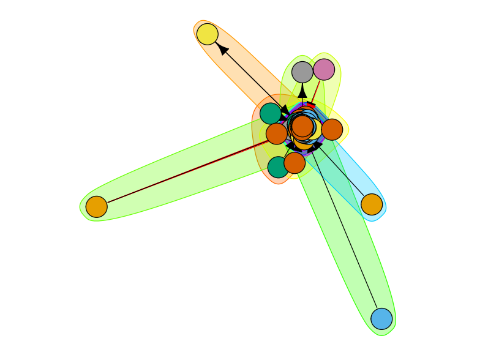

---
# Leave the homepage title empty to use the site title
title: ''
date: 2022-10-24
type: landing

sections:
  - block: about.biography
    id: about
    content:
      title: 
      # Choose a user profile to display (a folder name within `content/authors/`)
      username: admin
    design:
      css_class: 
  - block: collection
    id: work
    content:
      title: Work
      filters:
        folders:
          - work
        exclude_featured: true
    design:
      columns: '2'
      view: compact
  - block: collection
    id: education
    content:
      title: Education
      subtitle: ''
      text: ''
      # Choose how many pages you would like to display (0 = all pages)
      count: 0
      # Filter on criteria
      filters:
        folders:
          - education
        author: ""
        category: ""
        tag: ""
        exclude_featured: false
        exclude_future: false
        exclude_past: false
        publication_type: ""
      # Choose how many pages you would like to offset by
      offset: 0
      # Page order: descending (desc) or ascending (asc) date.
      order: desc
    design:
      # Choose a layout view
      view: compact
      columns: '2'  
  - block: collection
    id: projects
    content:
      title: Projects
      subtitle: ''
      text: ''
      # Choose how many pages you would like to display (0 = all pages)
      count: 5
      # Filter on criteria
      filters:
        folders:
          - projects
        author: ""
        category: ""
        tag: ""
        exclude_featured: false
        exclude_future: false
        exclude_past: false
        publication_type: ""
      # Choose how many pages you would like to offset by
      offset: 0
      # Page order: descending (desc) or ascending (asc) date.
      order: desc
    design:
      # Choose a layout view
      view: compact
      columns: '2'
  - block: markdown
    id: gallery
    content:
      title: Gallery
      text: |
        **Scroll to see more photos**

    

    {width=150}
    {width=150}
    {width=150}
    {width=150}
    {width=150}
    {width=150}
    {width=150}
    {width=150}
    {width=150}
    {width=150}
    {width=150}
    {width=150}
    {width=150}
    {width=150}
    {width=150}
    {width=150}
    {width=150}
    {width=150}
    {width=150}

    

    design:
      columns: '2'
      view: showcase
  - block: contact
    id: contact
    content:
      title: Contact
      # Contact (add or remove contact options as necessary)
      email: chicureledgar@gmail.com
      address:
        street: Calle de Albasanz, 26
        city: Madrid
        region: 
        postcode: 28037
        country: Spain
        country_code: ES
      directions: Office 3D16
      phone: +34 691 345 024
      # Automatically link email and phone or display as text?
      autolink: true
    design:
      columns: '2'
---
